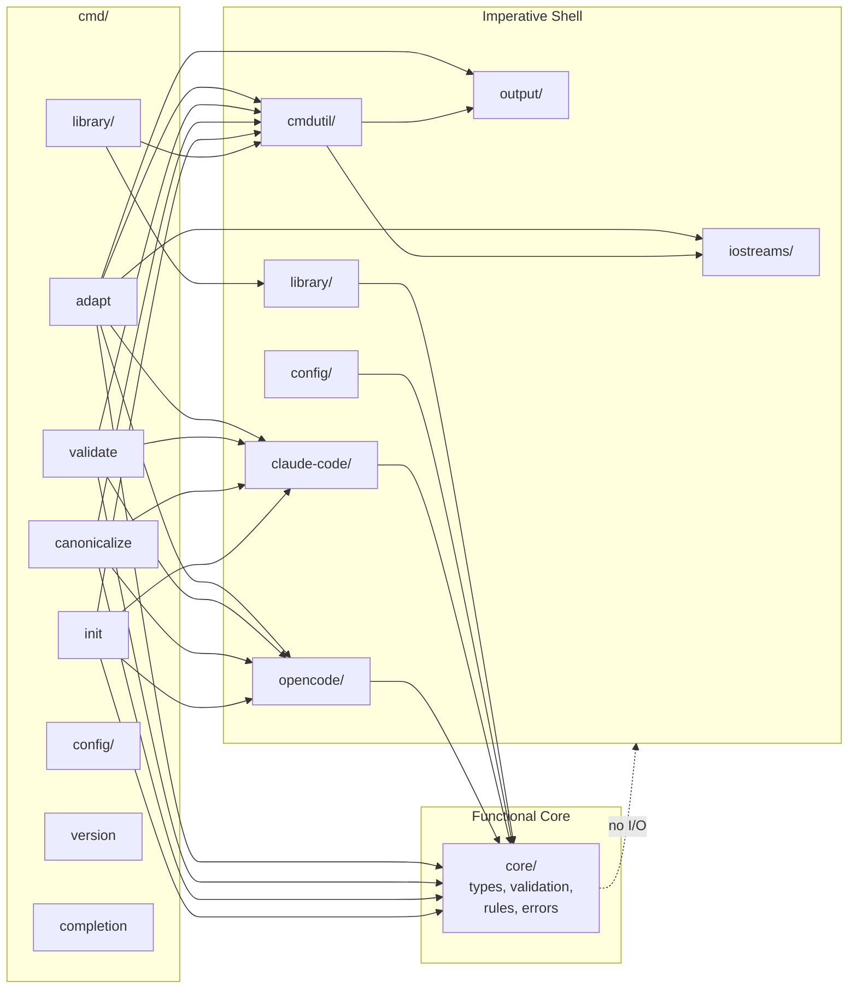
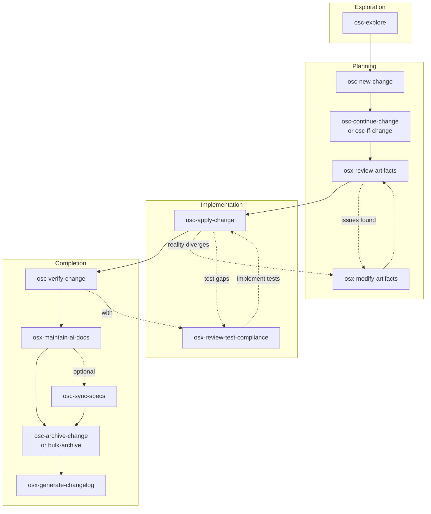

# Germinator - OpenCode Reference

Configuration adapter transforming AI coding assistant documents between platforms.

## Architecture



The target architecture is **golang-cli-architecture** (Functional Core / Imperative Shell). All I/O lives in shell packages (`iostreams/`, `output/`, `cmdutil/`, `config/`, `library/`, `claude-code/`, `opencode/`); `core/` is pure logic with stdlib + samber/lo only.

## Reference Skills

This project follows the **golang-cli-architecture** pattern. Load these skills when relevant:

| Skill | When to use |
|-------|-------------|
| `golang-cli-architecture` | Any architectural decision; the source of truth for layout, Factory, IOStreams, exit codes |
| `golang-design-patterns` | Functional options, constructors, resource lifecycle, error flow |
| `golang-error-handling` | Error wrapping with `%w`, errors.As/Is, custom error types, slog |
| `golang-testing` | Table-driven tests, testify, parallel tests, fuzzing, coverage |
| `golang-project-layout` | Package organization, `internal/` conventions, package boundaries |
| `golang-context` | `ctx` propagation, cancellation, deadlines |
| `golang-spf13-cobra` | Cobra API depth: command groups, `PersistentPreRunE`, `ValidArgsFunction` |
| `golang-lint` | golangci-lint config, depguard (core isolation), nolint directives |

## Essential Commands

| Command                | Purpose                                    |
| ---------------------- | ------------------------------------------ |
| mise run build         | Build CLI to bin/germinator                |
| mise run check         | All validation (lint, format, test, build) |
| mise run lint          | Run golangci-lint                          |
| mise run lint:fix      | Auto-fix linting issues                    |
| mise run format        | Format Go code                             |
| mise run test          | Run unit tests                             |
| mise run test:e2e      | Run E2E tests (Ginkgo v2)                  |
| mise run test:full     | Run all tests (unit + E2E)                 |
| mise run test:coverage | Run tests with coverage                    |
| mise run clean         | Clean artifacts                            |
| mise tasks             | List all tasks                             |

## Config Commands

| Command                       | Purpose                                      |
| ------------------------------ | -------------------------------------------- |
| `germinator config init`       | Scaffold a config file with documented fields |
| `germinator config validate`   | Validate an existing config file             |

**Config init flags:**
- `--output <path>` - Output file path (default: `~/.config/germinator/config.toml`)
- `--force` - Overwrite existing file

**Config validate flags:**
- `--output <path>` - Config file to validate (default: `~/.config/germinator/config.toml`)

## Library Commands

| Command                              | Purpose                                      |
| ------------------------------------ | -------------------------------------------- |
| `germinator library init`            | Scaffold a new library directory structure   |
| `germinator library add`              | Import a resource to the library             |
| `germinator library create preset`   | Create a new preset in the library           |
| `germinator library resources`      | List all resources (grouped by type)         |
| `germinator library presets`         | List all presets                             |
| `germinator library show <ref>`      | Display resource or preset details            |
| `germinator library refresh`         | Sync metadata from resource files             |
| `germinator library remove`          | Remove resource or preset                    |
| `germinator library validate`        | Check library integrity                      |

**Global `--json` flag:** All `germinator library` subcommands support `--json` for machine-readable output (inherited from parent command).

**Library init flags:**
- `--path <path>` - Library location (default: `$XDG_DATA_HOME/germinator/library/` or `~/.local/share/germinator/library/`)
- `--dry-run` - Preview changes without creating files
- `--force` - Overwrite existing library
- `--json` - Output as JSON (inherited from parent)

**Examples:**
```bash
germinator library init                          # Create at default path
germinator library init --path /tmp/my-library   # Custom location
germinator library init --dry-run                # Preview only
germinator library init --force                 # Overwrite existing
```

**Library add flags:**
- `--name <name>` - Resource name (auto-detected from frontmatter or filename if omitted)
- `--description <desc>` - Resource description (auto-detected if omitted)
- `--type <type>` - Resource type: `agent`, `command`, `skill`, or `memory` (auto-detected if omitted)
- `--platform <platform>` - Source platform: `opencode` or `claude-code` (auto-detected if omitted)
- `--library <path>` - Library path (uses `GERMINATOR_LIBRARY` env or default if omitted)
- `--dry-run` - Preview changes without modifying library
- `--force` - Overwrite existing resource with same name
- `--discover` - Find orphaned files not in library.yaml (recursive, report-only unless `--force` is also specified)
- `--batch` - Batch mode: process all discovered orphans continuously (use with `--discover --force`)
- `--json` - Output as JSON (inherited from parent)

**Discover behavior:**
- Scans `skills/`, `agents/`, `commands/`, `memory/` directories recursively
- Returns orphan info with path, type, name, and optional issue (e.g., "name_conflict")
- Summary includes: TotalScanned, TotalOrphans, TotalAdded, TotalSkipped, TotalFailed
- Batch mode continues processing on individual errors (skips failed orphans)

**Examples:**
```bash
germinator library add ~/code-reviewer.md --type agent          # Import agent
germinator library add ./skill-commit.md --platform opencode    # Import OpenCode skill
germinator library add resource.md --dry-run                    # Preview only
germinator library add resource.md --force                      # Replace if exists
germinator library add --discover                               # Find orphaned files (recursive)
germinator library add --discover --force                        # Find and register orphans
germinator library add --discover --batch --force                # Batch: discover all, add all (skip conflicts)
```

**Library create preset flags:**
- `--resources <refs>` - Comma-separated resource references (required, e.g., `skill/commit,agent/reviewer`)
- `--description <desc>` - Preset description (optional)
- `--force` - Overwrite existing preset
- `--library <path>` - Library path (uses `GERMINATOR_LIBRARY` env or default if omitted)

**Examples:**
```bash
germinator library create preset git-workflow --resources skill/commit,skill/pr
germinator library create preset dev-setup --resources skill/build,agent/reviewer --description "Development setup"
germinator library create preset old-preset --resources skill/commit --force
```

**Library resources flags:**
- `--library <path>` - Library path (uses `GERMINATOR_LIBRARY` env or default if omitted)
- `--json` - Output as JSON (inherited from parent)

**Examples:**
```bash
germinator library resources                              # List all resources grouped by type
germinator library resources --json                        # JSON output: {"resources": {...}}
```

**Library presets flags:**
- `--library <path>` - Library path (uses `GERMINATOR_LIBRARY` env or default if omitted)
- `--json` - Output as JSON (inherited from parent)

**Examples:**
```bash
germinator library presets                               # List all presets
germinator library presets --json                         # JSON output: {"presets": {...}}
```

**Library show flags:**
- `--library <path>` - Library path (uses `GERMINATOR_LIBRARY` env or default if omitted)
- `--json` - Output as JSON (inherited from parent)

**Examples:**
```bash
germinator library show skill/commit                     # Show resource details
germinator library show skill/commit --json               # JSON output
germinator library show preset/git-workflow --json        # Show preset as JSON
```

**Library remove resource flags:**
- `--library <path>` - Library path (uses `GERMINATOR_LIBRARY` env or default if omitted)
- `--json` - Output as JSON (inherited from parent)

**Library remove preset flags:**
- `--library <path>` - Library path (uses `GERMINATOR_LIBRARY` env or default if omitted)
- `--json` - Output as JSON (inherited from parent)

**Examples:**
```bash
germinator library remove resource skill/commit          # Remove a skill
germinator library remove resource agent/reviewer --json  # Remove with JSON output
germinator library remove preset git-workflow             # Remove a preset
```

**Library validate flags:**
- `--library <path>` - Library path (uses `GERMINATOR_LIBRARY` env or default if omitted)
- `--fix` - Auto-cleanup `library.yaml` (removes missing entries, strips ghost preset refs)
- `--json` - Output as JSON (inherited from parent)

**Examples:**
```bash
germinator library validate                              # Check library integrity
germinator library validate --json                        # JSON output for scripts
germinator library validate --fix                        # Auto-fix issues
```

**Exit codes:** `0` clean, `5` validation errors, `1` unexpected errors

**Library refresh flags:**
- `--library <path>` - Library path (uses `GERMINATOR_LIBRARY` env or default if omitted)
- `--dry-run` - Preview changes without modifying library
- `--force` - Skip resources with conflicts (name mismatch)
- `--json` - Output as JSON (inherited from parent)

**Examples:**
```bash
germinator library refresh                              # Sync metadata from files
germinator library refresh --dry-run                    # Preview what would change
germinator library refresh --force                       # Skip conflicts
germinator library refresh --json                        # JSON output for scripts
```

**What it does:**
- Updates `description` from frontmatter when stale
- Updates `path` when file renamed (if frontmatter name matches entry key)
- Skips missing files silently (use `validate --fix` to remove entries)
- Collects all errors and reports at end (exit code 1 if any errors)

## Release

| Command              | Purpose                                        |
| -------------------- | ---------------------------------------------- |
| mise run release     | Validate, update changelog, commit, and tag   |
| mise run release:check | Validate prerequisites (no execution)         |
| mise run release:prepare | Validate and preview operations             |
| mise run test:release | Test GoReleaser release flow (build only)     |

Workflow:
1. `mise run osx-changelog` - Generate changelog from archived OpenSpec changes
2. `mise run release:check` - Validate prerequisites
3. `mise run release:prepare <patch|minor|major>` - Preview what would happen
4. `mise run release <patch|minor|major>` - Execute release when ready

Optional: `mise run test:release` - Test goreleaser build without publishing

## Pre-Commit Hooks

Setup: `pre-commit install`
Run: `pre-commit run --all-files`
Skip: `git commit -m "msg" --no-verify`

Hooks: gofmt, govet, golangci-lint, YAML/TOML/JSON validation, file hygiene.

## OpenSpec Workflow

**Config**: `openspec/config.yaml` (spec-driven schema)

### When to Use

| Situation                       | Action                 |
| ------------------------------- | ---------------------- |
| Multi-step change (3+ tasks)    | Use OpenSpec           |
| New platform support            | Use OpenSpec           |
| Refactor / architectural change | Use OpenSpec           |
| Quick fix (1-2 lines)           | Skip OpenSpec          |
| Unclear requirements            | osc-explore first |

### Lifecycle



### Skills by Phase

| Phase              | Skill                             | Purpose                                          |
| ------------------ | --------------------------------- | ------------------------------------------------ |
| **Exploration**    | `osc-explore`                | Think through ideas                              |
| **Planning**       | `osc-new-change`             | Create change folder                             |
|                    | `osc-continue-change`        | Create one artifact                              |
|                    | `osc-ff-change`              | Create all artifacts at once                     |
|                    | `osx-review-artifacts`       | Review for quality                               |
|                    | `osx-modify-artifacts`       | Update artifacts _(also in Implementation)_      |
| **Implementation** | `osc-apply-change`           | Implement tasks                                  |
|                    | `osx-review-test-compliance` | Check spec→test alignment _(also in Completion)_ |
| **Completion**     | `osc-verify-change`          | Validate implementation                          |
|                    | `osx-maintain-ai-docs`       | Update AGENTS.md                                 |
|                    | `osc-sync-specs`             | Merge delta specs (optional)                     |
|                    | `osc-archive-change`         | Finalize single change                           |
|                    | `osc-bulk-archive-change`    | Archive multiple changes                         |
|                    | `osx-generate-changelog`     | Generate CHANGELOG.md                            |

### Project Conventions

| Rule      | Detail                                                                             |
| --------- | ---------------------------------------------------------------------------------- |
| Tests     | Unit tests alongside code, golden file tests for transformations, E2E for CLI, mocks for isolated unit testing      |
| Progress  | Check tasks.md in change folder for completion status                              |
| Artifacts | Follow openspec/config.yaml rules section                                          |
| Archive   | See openspec/changes/archive/ for examples                                         |

## Location-Specific Guides

> Listed paths reflect the target architecture after the golang-cli-architecture rewrite. Per-package docs are created/updated as slices land — see the corresponding change proposal.

| File                                                       | Purpose                                                      |
| ---------------------------------------------------------- | ------------------------------------------------------------ |
| [cmd/AGENTS.md](cmd/AGENTS.md)                             | CLI commands, Cobra patterns, command specs                  |
| [internal/core/AGENTS.md](internal/core/AGENTS.md)         | Functional Core: types, validation, rules, errors (pure)     |
| [internal/iostreams/AGENTS.md](internal/iostreams/AGENTS.md) | IOStreams abstraction, TTY detection, Styles, Verbosef     |
| [internal/output/AGENTS.md](internal/output/AGENTS.md)     | Shared output: FormatError, Exporter+AddJSONFlags, prompts   |
| [internal/cmdutil/AGENTS.md](internal/cmdutil/AGENTS.md)   | Factory (lazy fn fields), ExitCode mapping, cmd helpers     |
| [internal/config/AGENTS.md](internal/config/AGENTS.md)     | Configuration loading, XDG paths, TOML parsing               |
| [internal/library/AGENTS.md](internal/library/AGENTS.md)   | Library system, resource management, preset grouping         |
| [internal/claude-code/AGENTS.md](internal/claude-code/AGENTS.md) | Claude Code platform adapter                              |
| [internal/opencode/AGENTS.md](internal/opencode/AGENTS.md) | OpenCode platform adapter                                    |
| [internal/AGENTS.md](internal/AGENTS.md)                   | Internal package patterns (target layout)                    |
| [config/AGENTS.md](config/AGENTS.md)                       | Template patterns, permission mappings                       |
| [test/AGENTS.md](test/AGENTS.md)                           | Golden file testing, E2E testing, runF injection, fixture conventions |
| [openspec/research/AGENTS.md](openspec/research/AGENTS.md) | Platform research documentation usage                        |
