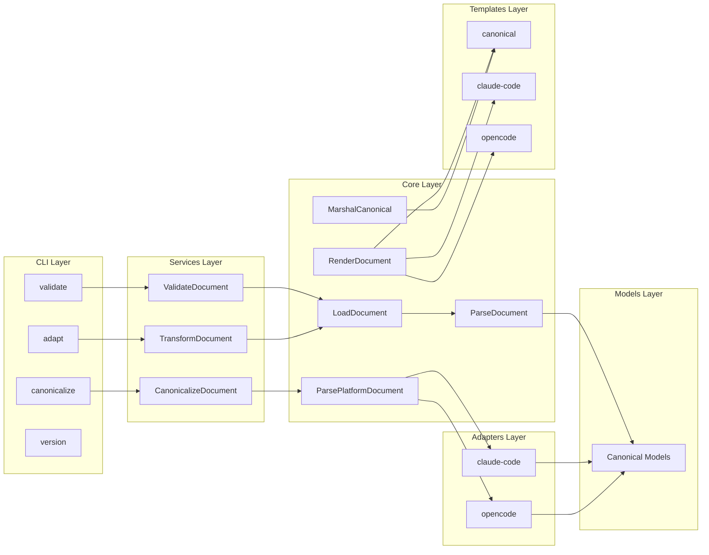
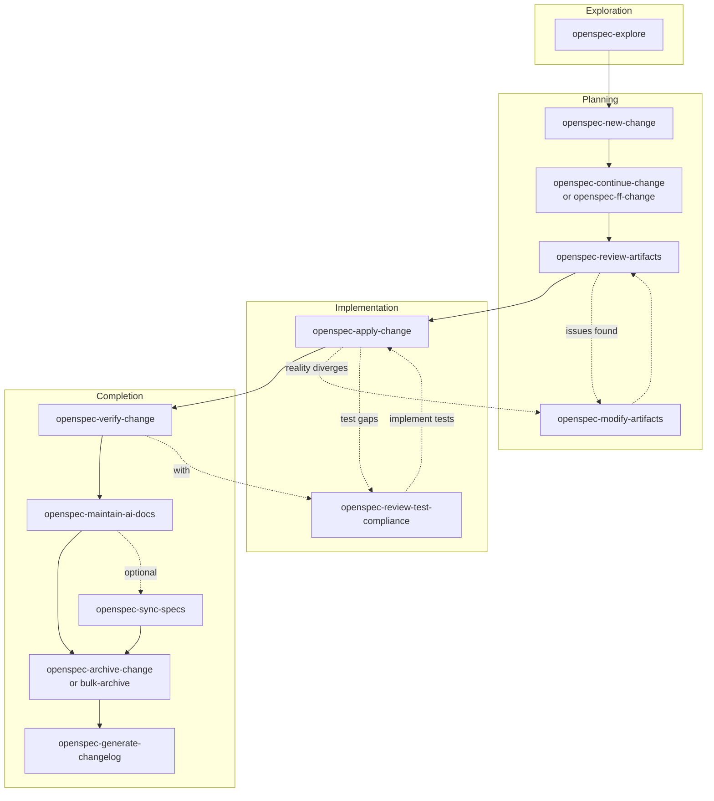

# Germinator - OpenCode Reference

Configuration adapter transforming AI coding assistant documents between platforms.

## Architecture

## Essential Commands

| Command                | Purpose                                    |
| ---------------------- | ------------------------------------------ |
| mise run build         | Build CLI to bin/germinator                |
| mise run check         | All validation (lint, format, test, build) |
| mise run lint          | Run golangci-lint                          |
| mise run lint:fix      | Auto-fix linting issues                    |
| mise run format        | Format Go code                             |
| mise run test          | Run all tests                              |
| mise run test:coverage | Run tests with coverage                    |
| mise run clean         | Clean artifacts                            |
| mise tasks             | List all tasks                             |

## Release

| Command                   | Purpose                                       |
| ------------------------- | --------------------------------------------- |
| mise run release:validate | Clean tree check                              |
| mise run release:dry-run  | Test GoReleaser                               |
| mise run release:tag      | Create and push git tag (patch\|minor\|major) |

## Pre-Commit Hooks

Setup: `pre-commit install`
Run: `pre-commit run --all-files`
Skip: `git commit -m "msg" --no-verify`

Hooks: gofmt, govet, golangci-lint, YAML/TOML/JSON validation, file hygiene.

## OpenSpec Workflow

**Config**: `openspec/config.yaml` (spec-driven schema)

### When to Use

| Situation                       | Action                 |
| ------------------------------- | ---------------------- |
| Multi-step change (3+ tasks)    | Use OpenSpec           |
| New platform support            | Use OpenSpec           |
| Refactor / architectural change | Use OpenSpec           |
| Quick fix (1-2 lines)           | Skip OpenSpec          |
| Unclear requirements            | openspec-explore first |

### Lifecycle

### Skills by Phase

| Phase              | Skill                             | Purpose                                          |
| ------------------ | --------------------------------- | ------------------------------------------------ |
| **Exploration**    | `openspec-explore`                | Think through ideas                              |
| **Planning**       | `openspec-new-change`             | Create change folder                             |
|                    | `openspec-continue-change`        | Create one artifact                              |
|                    | `openspec-ff-change`              | Create all artifacts at once                     |
|                    | `openspec-review-artifacts`       | Review for quality                               |
|                    | `openspec-modify-artifacts`       | Update artifacts _(also in Implementation)_      |
| **Implementation** | `openspec-apply-change`           | Implement tasks                                  |
|                    | `openspec-review-test-compliance` | Check spec→test alignment _(also in Completion)_ |
| **Completion**     | `openspec-verify-change`          | Validate implementation                          |
|                    | `openspec-maintain-ai-docs`       | Update AGENTS.md                                 |
|                    | `openspec-sync-specs`             | Merge delta specs (optional)                     |
|                    | `openspec-archive-change`         | Finalize single change                           |
|                    | `openspec-bulk-archive-change`    | Archive multiple changes                         |
|                    | `openspec-generate-changelog`     | Generate CHANGELOG.md                            |

### Project Conventions

| Rule      | Detail                                                        |
| --------- | ------------------------------------------------------------- |
| Tests     | Written alongside code, golden file tests for transformations |
| Progress  | Check tasks.md in change folder for completion status         |
| Artifacts | Follow openspec/config.yaml rules section                     |
| Archive   | See openspec/changes/archive/ for examples                    |

## Location-Specific Guides

| File                                                       | Purpose                                                      |
| ---------------------------------------------------------- | ------------------------------------------------------------ |
| [cmd/AGENTS.md](cmd/AGENTS.md)                             | CLI commands, Cobra patterns, command specs                  |
| [internal/core/AGENTS.md](internal/core/AGENTS.md)         | Document loading, parsing, serialization, template functions |
| [internal/services/AGENTS.md](internal/services/AGENTS.md) | Validation, transformation, canonicalization                 |
| [internal/AGENTS.md](internal/AGENTS.md)                   | Core package patterns, models integration                    |
| [config/AGENTS.md](config/AGENTS.md)                       | Template patterns, permission mappings                       |
| [test/AGENTS.md](test/AGENTS.md)                           | Golden file testing, fixture conventions, naming patterns    |
| [openspec/research/AGENTS.md](openspec/research/AGENTS.md) | Platform research documentation usage                        |
