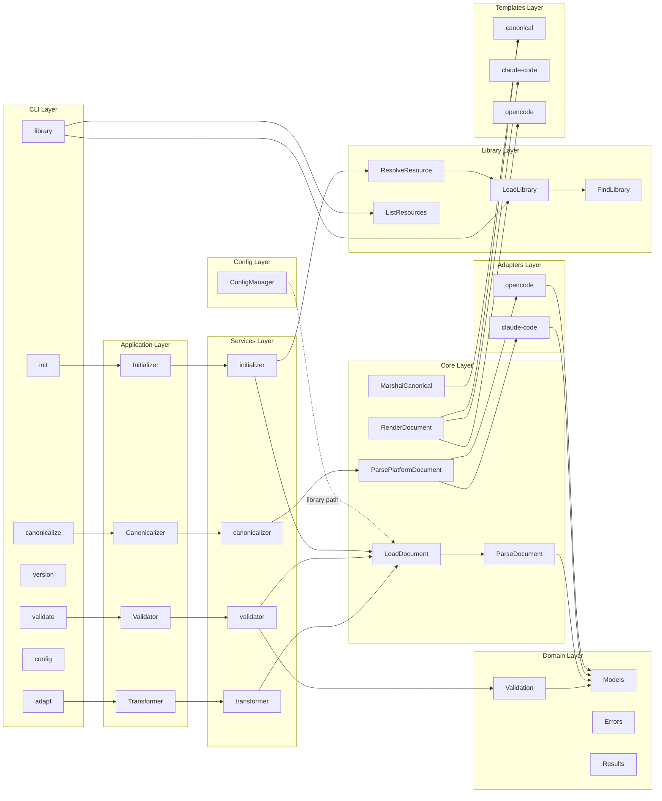
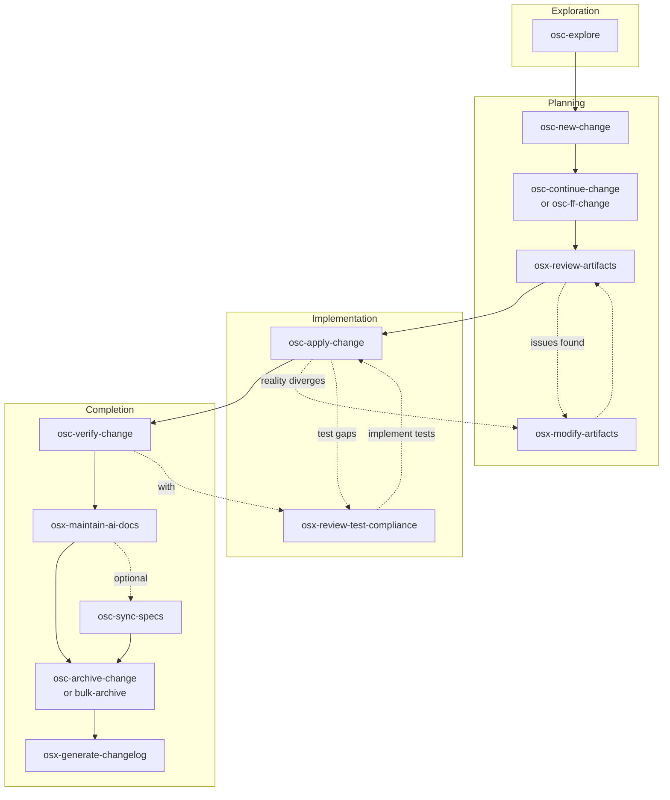

# Germinator - OpenCode Reference

Configuration adapter transforming AI coding assistant documents between platforms.

## Architecture



## Essential Commands

| Command                | Purpose                                    |
| ---------------------- | ------------------------------------------ |
| mise run build         | Build CLI to bin/germinator                |
| mise run check         | All validation (lint, format, test, build) |
| mise run lint          | Run golangci-lint                          |
| mise run lint:fix      | Auto-fix linting issues                    |
| mise run format        | Format Go code                             |
| mise run test          | Run unit tests                             |
| mise run test:e2e      | Run E2E tests (Ginkgo v2)                  |
| mise run test:full     | Run all tests (unit + E2E)                 |
| mise run test:coverage | Run tests with coverage                    |
| mise run clean         | Clean artifacts                            |
| mise tasks             | List all tasks                             |

## Config Commands

| Command                       | Purpose                                      |
| ------------------------------ | -------------------------------------------- |
| `germinator config init`       | Scaffold a config file with documented fields |
| `germinator config validate`   | Validate an existing config file             |

**Config init flags:**
- `--output <path>` - Output file path (default: `~/.config/germinator/config.toml`)
- `--force` - Overwrite existing file

**Config validate flags:**
- `--output <path>` - Config file to validate (default: `~/.config/germinator/config.toml`)

## Library Commands

| Command                              | Purpose                                      |
| ------------------------------------ | -------------------------------------------- |
| `germinator library init`            | Scaffold a new library directory structure   |
| `germinator library add`              | Import a resource to the library             |
| `germinator library create preset`   | Create a new preset in the library           |

**Library init flags:**
- `--path <path>` - Library location (default: `$XDG_DATA_HOME/germinator/library/` or `~/.local/share/germinator/library/`)
- `--dry-run` - Preview changes without creating files
- `--force` - Overwrite existing library

**Examples:**
```bash
germinator library init                          # Create at default path
germinator library init --path /tmp/my-library   # Custom location
germinator library init --dry-run                # Preview only
germinator library init --force                 # Overwrite existing
```

**Library add flags:**
- `--name <name>` - Resource name (auto-detected from frontmatter or filename if omitted)
- `--description <desc>` - Resource description (auto-detected if omitted)
- `--type <type>` - Resource type: `agent`, `command`, `skill`, or `memory` (auto-detected if omitted)
- `--platform <platform>` - Source platform: `opencode` or `claude-code` (auto-detected if omitted)
- `--library <path>` - Library path (uses `GERMINATOR_LIBRARY` env or default if omitted)
- `--dry-run` - Preview changes without modifying library
- `--force` - Overwrite existing resource with same name

**Examples:**
```bash
germinator library add ~/code-reviewer.md --type agent          # Import agent
germinator library add ./skill-commit.md --platform opencode    # Import OpenCode skill
germinator library add resource.md --dry-run                    # Preview only
germinator library add resource.md --force                      # Replace if exists
```

**Library create preset flags:**
- `--resources <refs>` - Comma-separated resource references (required, e.g., `skill/commit,agent/reviewer`)
- `--description <desc>` - Preset description (optional)
- `--force` - Overwrite existing preset
- `--library <path>` - Library path (uses `GERMINATOR_LIBRARY` env or default if omitted)

**Examples:**
```bash
germinator library create preset git-workflow --resources skill/commit,skill/pr
germinator library create preset dev-setup --resources skill/build,agent/reviewer --description "Development setup"
germinator library create preset old-preset --resources skill/commit --force
```

**Library remove resource flags:**
- `--json` - Output as JSON (for scripting)
- `--library <path>` - Library path (uses `GERMINATOR_LIBRARY` env or default if omitted)

**Library remove preset flags:**
- `--json` - Output as JSON (for scripting)
- `--library <path>` - Library path (uses `GERMINATOR_LIBRARY` env or default if omitted)

**Examples:**
```bash
germinator library remove resource skill/commit          # Remove a skill
germinator library remove resource agent/reviewer --json  # Remove with JSON output
germinator library remove preset git-workflow             # Remove a preset
```

**Library validate flags:**
- `--library <path>` - Library path (uses `GERMINATOR_LIBRARY` env or default if omitted)
- `--fix` - Auto-cleanup `library.yaml` (removes missing entries, strips ghost preset refs)
- `--json` - Output as JSON (for scripting)

**Examples:**
```bash
germinator library validate                              # Check library integrity
germinator library validate --json                        # JSON output for scripts
germinator library validate --fix                        # Auto-fix issues
```

**Exit codes:** `0` clean, `5` validation errors, `1` unexpected errors

## Release

| Command              | Purpose                                        |
| -------------------- | ---------------------------------------------- |
| mise run release     | Validate, update changelog, commit, and tag   |
| mise run release:check | Validate prerequisites (no execution)         |
| mise run release:prepare | Validate and preview operations             |
| mise run test:release | Test GoReleaser release flow (build only)     |

Workflow:
1. `mise run osx-changelog` - Generate changelog from archived OpenSpec changes
2. `mise run release:check` - Validate prerequisites
3. `mise run release:prepare <patch|minor|major>` - Preview what would happen
4. `mise run release <patch|minor|major>` - Execute release when ready

Optional: `mise run test:release` - Test goreleaser build without publishing

## Pre-Commit Hooks

Setup: `pre-commit install`
Run: `pre-commit run --all-files`
Skip: `git commit -m "msg" --no-verify`

Hooks: gofmt, govet, golangci-lint, YAML/TOML/JSON validation, file hygiene.

## OpenSpec Workflow

**Config**: `openspec/config.yaml` (spec-driven schema)

### When to Use

| Situation                       | Action                 |
| ------------------------------- | ---------------------- |
| Multi-step change (3+ tasks)    | Use OpenSpec           |
| New platform support            | Use OpenSpec           |
| Refactor / architectural change | Use OpenSpec           |
| Quick fix (1-2 lines)           | Skip OpenSpec          |
| Unclear requirements            | osc-explore first |

### Lifecycle



### Skills by Phase

| Phase              | Skill                             | Purpose                                          |
| ------------------ | --------------------------------- | ------------------------------------------------ |
| **Exploration**    | `osc-explore`                | Think through ideas                              |
| **Planning**       | `osc-new-change`             | Create change folder                             |
|                    | `osc-continue-change`        | Create one artifact                              |
|                    | `osc-ff-change`              | Create all artifacts at once                     |
|                    | `osx-review-artifacts`       | Review for quality                               |
|                    | `osx-modify-artifacts`       | Update artifacts _(also in Implementation)_      |
| **Implementation** | `osc-apply-change`           | Implement tasks                                  |
|                    | `osx-review-test-compliance` | Check spec→test alignment _(also in Completion)_ |
| **Completion**     | `osc-verify-change`          | Validate implementation                          |
|                    | `osx-maintain-ai-docs`       | Update AGENTS.md                                 |
|                    | `osc-sync-specs`             | Merge delta specs (optional)                     |
|                    | `osc-archive-change`         | Finalize single change                           |
|                    | `osc-bulk-archive-change`    | Archive multiple changes                         |
|                    | `osx-generate-changelog`     | Generate CHANGELOG.md                            |

### Project Conventions

| Rule      | Detail                                                                             |
| --------- | ---------------------------------------------------------------------------------- |
| Tests     | Unit tests alongside code, golden file tests for transformations, E2E for CLI, mocks for isolated unit testing      |
| Progress  | Check tasks.md in change folder for completion status                              |
| Artifacts | Follow openspec/config.yaml rules section                                          |
| Archive   | See openspec/changes/archive/ for examples                                         |

## Location-Specific Guides

| File                                                       | Purpose                                                      |
| ---------------------------------------------------------- | ------------------------------------------------------------ |
| [cmd/AGENTS.md](cmd/AGENTS.md)                             | CLI commands, Cobra patterns, command specs                  |
| [internal/application/AGENTS.md](internal/application/AGENTS.md) | Service interfaces, request types for DI (results moved to domain) |
| [internal/domain/AGENTS.md](internal/domain/AGENTS.md)     | Domain types, errors, validation, results (consolidated layer) |
| [internal/service/AGENTS.md](internal/service/AGENTS.md)   | Service implementations (Transformer, Validator, etc.)        |
| [internal/infrastructure/parsing/AGENTS.md](internal/infrastructure/parsing/AGENTS.md) | Document loading, parsing, platform detection |
| [internal/infrastructure/serialization/AGENTS.md](internal/infrastructure/serialization/AGENTS.md) | Serialization, template functions |
| [internal/infrastructure/adapters/AGENTS.md](internal/infrastructure/adapters/AGENTS.md) | Platform adapters (Claude Code, OpenCode) |
| [internal/infrastructure/config/AGENTS.md](internal/infrastructure/config/AGENTS.md) | Configuration loading, XDG paths, TOML parsing |
| [internal/infrastructure/library/AGENTS.md](internal/infrastructure/library/AGENTS.md) | Library system, resource management, preset grouping |
| [internal/AGENTS.md](internal/AGENTS.md)                   | Internal package patterns                                    |
| [config/AGENTS.md](config/AGENTS.md)                       | Template patterns, permission mappings                       |
| [test/AGENTS.md](test/AGENTS.md)                           | Golden file testing, E2E testing, mock infrastructure, fixture conventions        |
| [openspec/research/AGENTS.md](openspec/research/AGENTS.md) | Platform research documentation usage                        |
