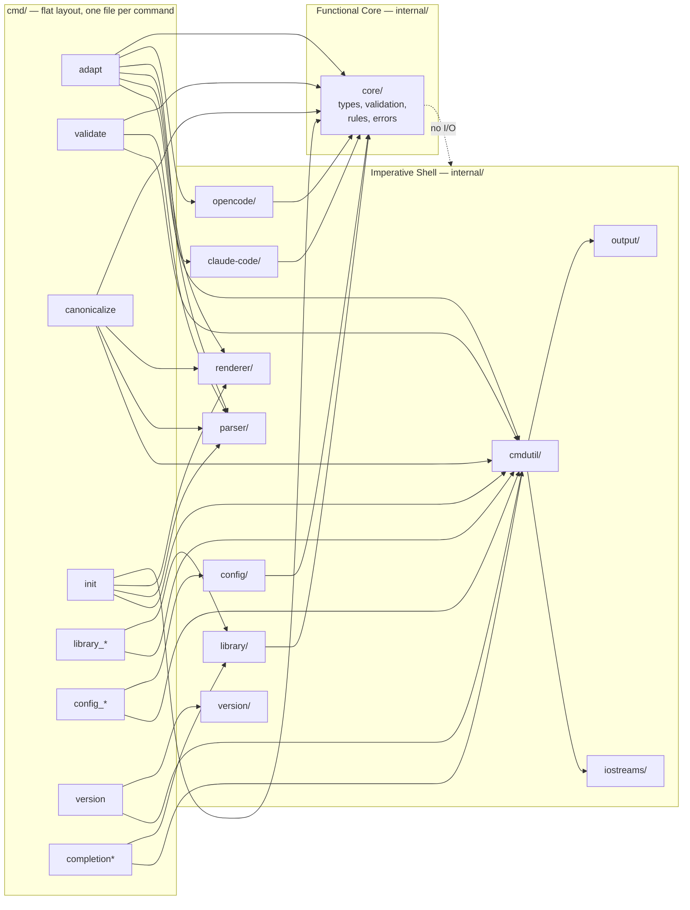
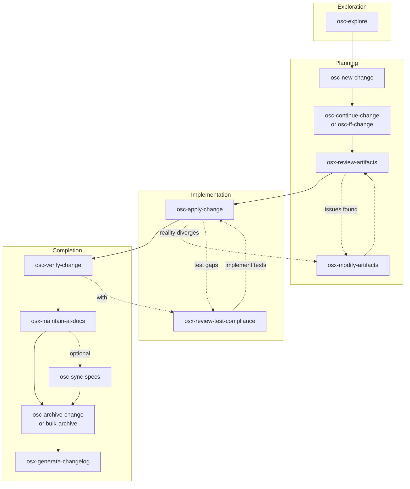

# Germinator - OpenCode Reference

Configuration adapter transforming AI coding assistant documents between platforms.

## Architecture



The target architecture is **golang-cli-architecture** (Functional Core / Imperative Shell). All I/O lives in shell packages (`iostreams/`, `output/`, `cmdutil/`, `config/`, `library/`, `claude-code/`, `opencode/`, `parser/`, `renderer/`, `version/`); `core/` is pure logic with stdlib + samber/lo only. `cmd/` uses a **flat layout** — one `.go` file per command, with multi-word commands as sibling files (`library.go`, `library_add.go`, `config_init.go`), not subdirectories.

## Reference Skills

This project follows the **`golang-cli-architecture`** skill as its primary reference. It is the **only** Go skill always-loaded at session start. All other Go skills are loaded **on demand** based on task intent. Per-package AGENTS.md files (see [Location-Specific Guides](#location-specific-guides)) inline-link specific `golang-cli-architecture/references/*.md` files via `@<path>` and remain authoritative for their domain.

Library selection rationale: `@.opencode/skills/golang-cli-architecture/references/14-libraries.md`

### Primary skill — always loaded

Load **`golang-cli-architecture`** (`@.opencode/skills/golang-cli-architecture/SKILL.md`)
at the start of **every** Go task. It is the source of truth for:

- Project layout (`cmd/` flat, `internal/core/` Functional Core, `internal/<x>/` Imperative Shell)
- Factory pattern with lazy function fields (replaces DI containers)
- IOStreams abstraction, exit code mapping, error formatting
- CLI testing pyramid (Core unit → Command via `runF` → Integration → E2E)
- Three-concern model (Parse / Execute / Respond)

> **Token budget.** Always-loaded skills add their description tokens to every
> session (~100 tokens per skill). `golang-cli-architecture` is the only Go skill
> with mandatory session-startup load.

### Intent-based skill loading

For each Go task, load the **primary** skill plus any **secondary** skill(s) the
intent requires. `golang-cli-architecture` is **always** a secondary (it is the
always-loaded primary above). Do not load all skills — pick by intent.

| Intent                                         | Primary                          | Also load                                                                                       |
|------------------------------------------------|----------------------------------|-------------------------------------------------------------------------------------------------|
| Add/restruct a CLI command, scaffold a command | `golang-cli-architecture`        | `golang-spf13-cobra`, `golang-naming`, `golang-code-style`                                      |
| Add a Functional Core type, validator, or rule | `golang-design-patterns`        | `golang-cli-architecture`, `golang-structs-interfaces`, `golang-samber-lo`                      |
| Add Factory wiring / lazy fn fields            | `golang-design-patterns`        | `golang-cli-architecture`                                                                       |
| Implement error wrapping, errors.Is/As, slog   | `golang-error-handling`          | `golang-cli-architecture`, `golang-safety` (nil-heavy code)                                     |
| Add a Cobra command group, ValidArgsFunction, completion | `golang-spf13-cobra`    | `golang-cli-architecture`                                                                       |
| Use samber/lo helpers in `core/`               | `golang-samber-lo`               | `golang-cli-architecture`, `golang-data-structures`                                             |
| Write unit tests with testify                  | `golang-stretchr-testify`        | `golang-cli-architecture`, `golang-testing`                                                     |
| Write integration or E2E test                  | `golang-cli-architecture`        | `golang-testing`, `golang-stretchr-testify`                                                     |
| Configure / tune golangci-lint                 | `golang-lint`                    | `golang-cli-architecture`, `golang-code-style`                                                  |
| Debug a panic, deadlock, or unexpected behavior | `golang-troubleshooting`        | `golang-cli-architecture`, `golang-safety`                                                      |
| Refactor across packages                       | `golang-design-patterns`        | `golang-cli-architecture`, `golang-naming`, `golang-code-style`                                 |
| Modernize for a new Go version                 | `golang-modernize`               | `golang-cli-architecture`, `golang-lint`                                                        |
| Write godoc for an `internal/` package         | `golang-documentation`           | `golang-cli-architecture`, `golang-naming`                                                      |
| Review formatting, style, naming               | `golang-code-style`              | `golang-cli-architecture`, `golang-naming`, `golang-lint`                                       |
| Propagate ctx / add cancellation               | `golang-context`                 | `golang-cli-architecture`                                                                       |
| Choose a new library                           | `golang-cli-architecture` (read `references/14-libraries.md`) | —                                                              |
| Look up an unfamiliar package                  | `golang-pkg-go-dev`              | `golang-cli-architecture`                                                                       |
| Navigate / refactor locally with gopls         | `golang-gopls`                   | `golang-cli-architecture`                                                                       |

> **Note on `golang-testing`:** it is partially superseded by
> `golang-cli-architecture` for the CLI testing pyramid
> (Core → Command via `runF` → Integration → E2E). It is kept for
> table-driven patterns, fuzzing, goleak, and coverage idioms.
>
> **Note on configuration:** germinator uses **`koanf`**, not `viper`.
> `golang-spf13-viper` is intentionally not listed. Library rationale:
> `@.opencode/skills/golang-cli-architecture/references/14-libraries.md`.

### Skill catalog (secondary)

| Category        | Skills                                                                                                                       |
|-----------------|------------------------------------------------------------------------------------------------------------------------------|
| Code Quality    | `golang-code-style`, `golang-naming`, `golang-documentation`, `golang-lint`, `golang-safety`                                 |
| Architecture    | `golang-design-patterns`, `golang-structs-interfaces`, `golang-context`                                                      |
| Errors          | `golang-error-handling`                                                                                                      |
| Testing         | `golang-testing`, `golang-stretchr-testify`                                                                                  |
| Libraries       | `golang-spf13-cobra`, `golang-samber-lo`                                                                                     |
| Tools           | `golang-troubleshooting`, `golang-modernize`, `golang-gopls`, `golang-pkg-go-dev`                                             |

### Supersession — DO NOT load these `samber/cc-skills-golang` skills

The following samber skills are explicitly overridden by local skills or by
project decisions and should NOT be loaded for germinator work:

- `samber/cc-skills-golang@golang-cli` → superseded by `golang-cli-architecture`
- `samber/cc-skills-golang@golang-dependency-injection` → Factory pattern replaces DI containers
- `samber/cc-skills-golang@golang-project-layout` → CLI-specific Tier 1/2/3 layouts
- `samber/cc-skills-golang@golang-concurrency` → sequential-first for CLIs
- `samber/cc-skills-golang@golang-spf13-viper` → we use **koanf**, not viper

Domain-mismatched skills (also not loaded): `golang-database`, `golang-graphql`,
`golang-grpc`, `golang-swagger`, `golang-observability`, `golang-benchmark`,
`golang-performance`, all DI container skills (`golang-google-wire`,
`golang-uber-dig`, `golang-uber-fx`, `golang-samber-do`), and all other
`samber/*` skills not listed in the catalog above.

## Essential Commands

| Command                | Purpose                                    |
| ---------------------- | ------------------------------------------ |
| mise run build         | Build CLI to bin/germinator                |
| mise run check         | All validation (lint, format, test, build) |
| mise run lint          | Run golangci-lint                          |
| mise run lint:fix      | Auto-fix linting issues                    |
| mise run format        | Format Go code                             |
| mise run test          | Run unit tests                             |
| mise run test:e2e      | Run E2E tests (Ginkgo v2)                  |
| mise run test:full     | Run all tests (unit + E2E)                 |
| mise run test:coverage | Run tests with coverage                    |
| mise run clean         | Clean artifacts                            |
| mise tasks             | List all tasks                             |

## Config Commands

| Command                       | Purpose                                      |
| ------------------------------ | -------------------------------------------- |
| `germinator config init`       | Scaffold a config file with documented fields |
| `germinator config validate`   | Validate an existing config file             |

**Config init flags:**
- `--output-path <path>` - Output file path (default: `~/.config/germinator/config.toml`)
- `--force` - Overwrite existing file

**Config validate flags:**
- `--output-path <path>` - Config file to validate (default: `~/.config/germinator/config.toml`)

## Library Commands

| Command                              | Purpose                                      |
| ------------------------------------ | -------------------------------------------- |
| `germinator library init`            | Scaffold a new library directory structure   |
| `germinator library add`              | Import a resource to the library             |
| `germinator library create preset`   | Create a new preset in the library           |
| `germinator library resources`      | List all resources (grouped by type)         |
| `germinator library presets`         | List all presets                             |
| `germinator library show <ref>`      | Display resource or preset details            |
| `germinator library refresh`         | Sync metadata from resource files             |
| `germinator library remove`          | Remove resource or preset                    |
| `germinator library validate`        | Check library integrity                      |

**Global `--output` flag:** All `germinator library` subcommands support `--output plain|json|table` via `cmdutil.AddOutputFlags`. `json` is for scripts, `table` for humans, `plain` is the default.

**Library init flags:**
- `--path <path>` - Library location (default: `$XDG_DATA_HOME/germinator/library/` or `~/.local/share/germinator/library/`)
- `--dry-run` - Preview changes without creating files
- `--force` - Overwrite existing library
- `--output <format>` - `plain` (default), `json`, or `table`

**Examples:**
```bash
germinator library init                          # Create at default path
germinator library init --path /tmp/my-library   # Custom location
germinator library init --dry-run                # Preview only
germinator library init --force                 # Overwrite existing
germinator library init --output json            # Machine-readable
```

**Library add flags:**
- `--name <name>` - Resource name (auto-detected from frontmatter or filename if omitted)
- `--description <desc>` - Resource description (auto-detected if omitted)
- `--type <type>` - Resource type: `agent`, `command`, `skill`, or `memory` (auto-detected if omitted)
- `--platform <platform>` - Source platform: `opencode` or `claude-code` (auto-detected if omitted)
- `--library <path>` - Library path (uses `GERMINATOR_LIBRARY` env or default if omitted)
- `--dry-run` - Preview changes without modifying library
- `--force` - Overwrite existing resource with same name
- `--discover` - Find orphaned files not in library.yaml (recursive, report-only unless `--force` is also specified)
- `--batch` - Batch mode: process all discovered orphans continuously (use with `--discover --force`)
- `--output <format>` - Output format: `plain` (default, byte-identical to legacy), `json`, or `table`

**Discover behavior:**
- Scans `skills/`, `agents/`, `commands/`, `memory/` directories recursively
- Returns orphan info with path, type, name, and optional issue (e.g., "name_conflict")
- Summary includes: TotalScanned, TotalOrphans, TotalAdded, TotalSkipped, TotalFailed
- Batch mode continues processing on individual errors (skips failed orphans)

**Examples:**
```bash
germinator library add ~/code-reviewer.md --type agent          # Import agent
germinator library add ./skill-commit.md --platform opencode    # Import OpenCode skill
germinator library add resource.md --dry-run                    # Preview only
germinator library add resource.md --force                      # Replace if exists
germinator library add --discover                               # Find orphaned files (recursive)
germinator library add --discover --force                        # Find and register orphans
germinator library add --discover --batch --force                # Batch: discover all, add all (skip conflicts)
```

**Library create preset flags:**
- `--resources <refs>` - Comma-separated resource references (required, e.g., `skill/commit,agent/reviewer`)
- `--description <desc>` - Preset description (optional)
- `--force` - Overwrite existing preset
- `--library <path>` - Library path (uses `GERMINATOR_LIBRARY` env or default if omitted)

**Examples:**
```bash
germinator library create preset git-workflow --resources skill/commit,skill/pr
germinator library create preset dev-setup --resources skill/build,agent/reviewer --description "Development setup"
germinator library create preset old-preset --resources skill/commit --force
```

**Library resources flags:**
- `--library <path>` - Library path (uses `GERMINATOR_LIBRARY` env or default if omitted)
- `--output <format>` - `plain` (default), `json`, or `table`

**Examples:**
```bash
germinator library resources                              # List all resources grouped by type
germinator library resources --output json                 # JSON output: {"resources": {...}}
```

**Library presets flags:**
- `--library <path>` - Library path (uses `GERMINATOR_LIBRARY` env or default if omitted)
- `--output <format>` - `plain` (default), `json`, or `table`

**Examples:**
```bash
germinator library presets                               # List all presets
germinator library presets --output json                  # JSON output: {"presets": {...}}
```

**Library show flags:**
- `--library <path>` - Library path (uses `GERMINATOR_LIBRARY` env or default if omitted)
- `--output <format>` - `plain` (default), `json`, or `table`

**Examples:**
```bash
germinator library show skill/commit                     # Show resource details
germinator library show skill/commit --output json        # JSON output
germinator library show preset/git-workflow --output json # Show preset as JSON
```

**Library remove resource flags:**
- `--library <path>` - Library path (uses `GERMINATOR_LIBRARY` env or default if omitted)
- `--force` - Skip confirmation prompts and remove unconditionally
- `--output <format>` - `plain` (default), `json`, or `table`

**Library remove preset flags:**
- `--library <path>` - Library path (uses `GERMINATOR_LIBRARY` env or default if omitted)
- `--force` - No-op for preset removal (no physical file to force); accepted for parent-child flag symmetry
- `--output <format>` - `plain` (default), `json`, or `table`

**Examples:**
```bash
germinator library remove resource skill/commit                      # Remove a skill
germinator library remove resource agent/reviewer --output json      # Remove with JSON output
germinator library remove preset git-workflow                         # Remove a preset
germinator library remove resource skill/test --force                # Skip confirmation
```

**Library validate flags:**
- `--library <path>` - Library path (uses `GERMINATOR_LIBRARY` env or default if omitted)
- `--fix` - Auto-cleanup `library.yaml` (removes missing entries, strips ghost preset refs)
- `--output <format>` - `plain` (default), `json`, or `table`

**Examples:**
```bash
germinator library validate                              # Check library integrity
germinator library validate --output json                 # JSON output for scripts
germinator library validate --fix                         # Auto-fix issues
germinator library validate --fix --output json           # Machine-readable fix report
germinator library validate --fix --output table          # Action/ref table
```

**Library refresh flags:**
- `--library <path>` - Library path (uses `GERMINATOR_LIBRARY` env or default if omitted)
- `--dry-run` - Preview changes without modifying library
- `--force` - Skip resources with conflicts (name mismatch)
- `--output <format>` - `plain` (default), `json`, or `table`

**Examples:**
```bash
germinator library refresh                              # Sync metadata from files
germinator library refresh --dry-run                    # Preview what would change
germinator library refresh --force                       # Skip conflicts
germinator library refresh --output json                 # JSON output for scripts
germinator library refresh --output table                # Per-change table
```

**What it does:**
- Updates `description` from frontmatter when stale
- Updates `path` when file renamed (if frontmatter name matches entry key)
- Skips missing files silently (use `validate --fix` to remove entries)
- Reports `Refreshed`, `Unchanged`, `Skipped`, `Errors` sections in plain output
- Exit code 1 if any errors occurred

## Release

| Command              | Purpose                                        |
| -------------------- | ---------------------------------------------- |
| mise run release     | Validate, update changelog, commit, and tag   |
| mise run release:check | Validate prerequisites (no execution)         |
| mise run release:prepare | Validate and preview operations             |
| mise run test:release | Test GoReleaser release flow (build only)     |

Workflow:
1. `mise run osx-changelog` - Generate changelog from archived OpenSpec changes
2. `mise run release:check` - Validate prerequisites
3. `mise run release:prepare <patch|minor|major>` - Preview what would happen
4. `mise run release <patch|minor|major>` - Execute release when ready

Optional: `mise run test:release` - Test goreleaser build without publishing

## Pre-Commit Hooks

Setup: `pre-commit install`
Run: `pre-commit run --all-files`
Skip: `git commit -m "msg" --no-verify`

Hooks: gofmt, govet, golangci-lint, YAML/TOML/JSON validation, file hygiene.

## OpenSpec Workflow

**Config**: `openspec/config.yaml` (spec-driven schema)

> **Spec organization** — Specs follow the flat layout described in [`openspec/specs/AGENTS.md`](openspec/specs/AGENTS.md): `openspec/specs/<category>-<spec-name>/spec.md`. Always consult the local AGENTS.md before creating, syncing, or moving a spec to pick the right category prefix.

### When to Use

| Situation                       | Action                 |
| ------------------------------- | ---------------------- |
| Multi-step change (3+ tasks)    | Use OpenSpec           |
| New platform support            | Use OpenSpec           |
| Refactor / architectural change | Use OpenSpec           |
| Quick fix (1-2 lines)           | Skip OpenSpec          |
| Unclear requirements            | osc-explore first |

### Lifecycle



### Skills by Phase

| Phase              | Skill                             | Purpose                                          |
| ------------------ | --------------------------------- | ------------------------------------------------ |
| **Exploration**    | `osc-explore`                | Think through ideas                              |
| **Planning**       | `osc-new-change`             | Create change folder                             |
|                    | `osc-continue-change`        | Create one artifact                              |
|                    | `osc-ff-change`              | Create all artifacts at once                     |
|                    | `osx-review-artifacts`       | Review for quality                               |
|                    | `osx-modify-artifacts`       | Update artifacts _(also in Implementation)_      |
| **Implementation** | `osc-apply-change`           | Implement tasks                                  |
|                    | `osx-review-test-compliance` | Check spec→test alignment _(also in Completion)_ |
| **Completion**     | `osc-verify-change`          | Validate implementation                          |
|                    | `osx-maintain-ai-docs`       | Update AGENTS.md                                 |
|                    | `osc-sync-specs`             | Merge delta specs (optional)                     |
|                    | `osc-archive-change`         | Finalize single change                           |
|                    | `osc-bulk-archive-change`    | Archive multiple changes                         |
|                    | `osx-generate-changelog`     | Generate CHANGELOG.md                            |

### Project Conventions

| Rule      | Detail                                                                             |
| --------- | ---------------------------------------------------------------------------------- |
| Tests     | Unit tests alongside code, golden file tests for transformations, E2E for CLI, mocks for isolated unit testing      |
| Progress  | Check tasks.md in change folder for completion status                              |
| Artifacts | Follow openspec/config.yaml rules section                                          |
| Archive   | See openspec/changes/archive/ for examples                                         |

## Location-Specific Guides

| File                                                       | Purpose                                                      |
| ---------------------------------------------------------- | ------------------------------------------------------------ |
| [cmd/AGENTS.md](cmd/AGENTS.md)                             | CLI architecture: DI, error handling, exit codes, verbosity, lint enforcement |
| [cmd/commands/AGENTS.md](cmd/commands/AGENTS.md)           | Per-command flag tables and behavior (Library, Init, Config, Completion) |
| [internal/core/AGENTS.md](internal/core/AGENTS.md)         | Functional Core: types, validation, rules, errors (pure)     |
| [internal/iostreams/AGENTS.md](internal/iostreams/AGENTS.md) | IOStreams abstraction, TTY detection, Styles, Verbosef     |
| [internal/output/AGENTS.md](internal/output/AGENTS.md)     | Shared output: FormatError, Exporter, AddOutputFlags         |
| [internal/cmdutil/AGENTS.md](internal/cmdutil/AGENTS.md)   | Factory (lazy fn fields), ExitCode mapping, cmd helpers     |
| [internal/config/AGENTS.md](internal/config/AGENTS.md)     | Configuration loading, XDG paths, TOML parsing               |
| [internal/library/AGENTS.md](internal/library/AGENTS.md)   | Library system, resource management, preset grouping         |
| [internal/claude-code/AGENTS.md](internal/claude-code/AGENTS.md) | Claude Code platform adapter                              |
| [internal/opencode/AGENTS.md](internal/opencode/AGENTS.md) | OpenCode platform adapter                                    |
| [internal/AGENTS.md](internal/AGENTS.md)                   | Internal package patterns                                    |
| [config/AGENTS.md](config/AGENTS.md)                       | Template patterns, permission mappings                       |
| [openspec/specs/AGENTS.md](openspec/specs/AGENTS.md)       | Spec layout (`<category>-<spec-name>/spec.md`)                |
| [test/AGENTS.md](test/AGENTS.md)                           | Golden file testing, E2E testing, runF injection, fixture conventions |
| [openspec/research/AGENTS.md](openspec/research/AGENTS.md) | Platform research documentation usage                        |
